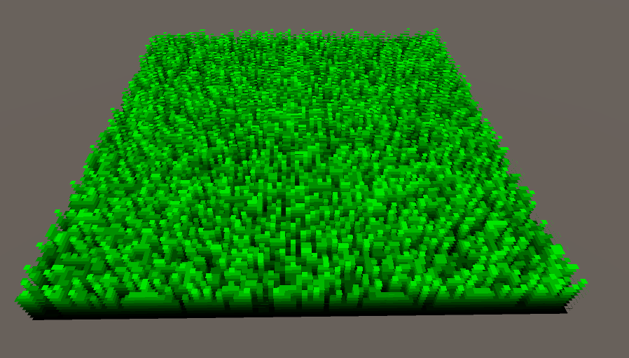

# Shell-Texturing WIP

 
render quad

green pixel is grass and black is no grass

use white noise for random numbers

hash function that takes seed number and shuffle around alot that it is unique

uv coords range from top left to bottom right

take seed through hashing function to give us random number between 0-1

if value is > 0 return green

plane should be entirely green(like one big grass)

to get more blades of grass  seed = ⌊uv * density⌋  (density being the width and height of the field)

with a density of 100, we have a field of 100 x 100 blades of grass

draw another quad(slightly higher than the ground)

quad seed number will be the same which is good

but now instead of if(rng > 0) do if(rng > NewQuadHeight)

then draw new square with the new height

draw 16 squares

now discard the black pixels

to get some easy lighting just multiply the color * height^attenuation  (height of the quad)

Shell Texturing made

with hashing function we compute a seed from the uv coords