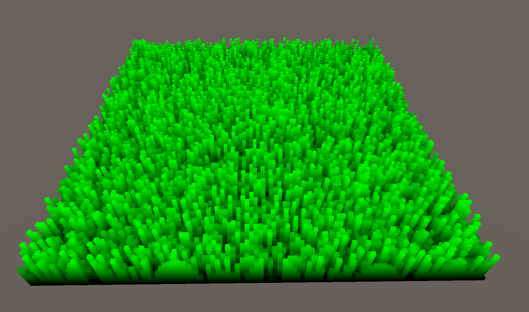
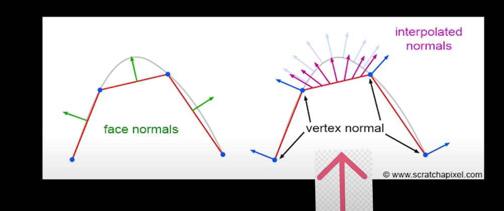

# Shell-Texturing WIP

#### Iteration 1

#### Iteration 2

### Steps Taken:
 
- Render quad

- Green pixel is grass and black is no grass

- Use white noise for random numbers

- Hash function that takes seed number and shuffle around alot that it is unique

- UV coords range from top left to bottom right

- Take seed through hashing function to give us random number between 0-1

- If value is > 0 return green

- Plane should be entirely green(like one big grass)

- To get more blades of grass  seed = ⌊uv * density⌋  (density being the width and height of the field)

- With a density of 100, we have a field of 100 x 100 blades of grass

- Draw another quad(slightly higher than the ground)

- Quad seed number will be the same which is good

- Tut now instead of if(rng > 0) do if(rng > NewQuadHeight)

- Then draw new square with the new height

- Draw 16 squares

- Now discard the black pixels

- To get some easy lighting just multiply the color * height^attenuation  (height of the quad)

- With hashing function we compute a seed from the uv coords

- The quads need to spawn between 0.0 and 0.1, but the threshold should be between 0.0 and 1.0

- We can translate shell textured grass from a plane to any arbitrary mesh by extruding the shell out from the normal of the base vertex:

- So for a sphere, draw a bunch of spheres on top of each other

- Then in the vertex shader, extrude the shells outwards from the normals based on desired distance