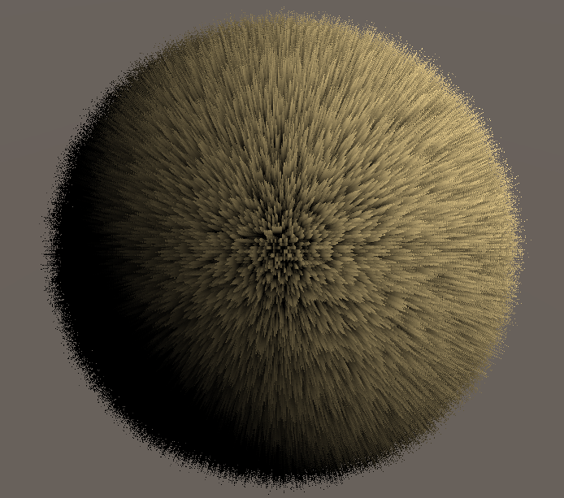

# Shell-Texturing WIP

The first two iterations use the CPU to calculate positions of quads

The third iteration is a code overhaul that uses the GPU entirely(AKA even faster and efficienter)

#### Iteration 1

#### Iteration 2

#### Iteration 3

#### Illusion of fur

#### Hair like strands

#### Lambertian diffuse lighting

#### Valve's Half Lambert lighting

#### No Occlusion Bias creates fluffy dandelion

#### Gravity applied

#### Wind effect

### Steps Taken:
 
- Render quad

- Give quad a seed value that was outputted by a hash function

- if rng > 0.01, render green color: else black

- Quad is entirely green, essentially one big blade of grass

- To get more blades of grass seed = ⌊uv * density⌋  (density being the width and height of the field)

- With a density of 100, we have a field of 100 x 100 blades of grass

- Draw another quad(with new quad uv oords being slightly higher than the the previous quad)

- Quad seed number will be the same which is good

- Now instead of if(rng > 0) do if(rng > NewQuadHeight)

- Draw 16 squares

- Now discard the black pixels and now we have "grass"

- To get some easy lighting just multiply the color * height^attenuation  (height of the quad)

- Now we can translate shell textured grass from a plane to any arbitrary mesh by extruding the shell out from the normal of the base vertex:

- So for a sphere, draw a bunch of spheres on top of each other

- Then in the vertex shader, extrude the shells outwards from the normals based on desired distance:
  - vertex.xyz += vertex.xyz * distance * height

- Next to get the grass to look more like by making more strand like(thicker at bottom thinner at top)

- We can give:
  - local space = frac(uv * density)

- The origin of space is in top left, so we translate it to center using:
  - localUV = frac(uv) * 2 - 1;

- Now we check if that distance is greater than our thickness: discard;

- Calculate Lambertian Diffuse Lighting
  - Calculate the normal vector of the surface at each fragment. This is usually done in the vertex shader and interpolated across the surface for each fragment.
    - surfaceNormal = normalize(fragmentNormal);
  - Determine the direction of the incoming light. This can be a fixed direction if you have a single light source, or you may calculate it dynamically based on the position of light sources in your scene.
    - lightDir = normalize(lightPosition - fragmentPosition);
  - Find the cosine of the angle between the surface normal and the light direction vector. This can be done using the dot product of the normalized surface normal and the normalized light direction vectors.
    - cosineTheta = dot(surfaceNormal, lightDir);
  - Use Lambert's cosine law to calculate the diffuse reflection intensity. This is typically done by multiplying the cosine of the angle by the intensity of the light hitting the surface and the surface's diffuse reflectance coefficient (albedo).
    - diffuseIntensity = max(cosineTheta, 0.0);

- Lambertian lighting, the intensity of the diffuse reflection is proportional to the cosine of the angle between the surface normal and the light direction. However, this can lead to very dark regions on surfaces that face away from the light source, which might not look visually pleasing.

- Half Lambert lighting addresses this issue by squaring the cosine of the angle (often referred to as "cosine falloff") before using it in the lighting calculation. This has the effect of making dark areas less dark, resulting in a more even distribution of light across the surface.
  - ndotl = DotClamped(i.normal, _WorldSpaceLightPos0) * 0.5 + 0.5;
  - ndotl = ndotl * ndotl;

## Upgrades

- Use some texture data instead of white noise

- Fluffy fur breakdown